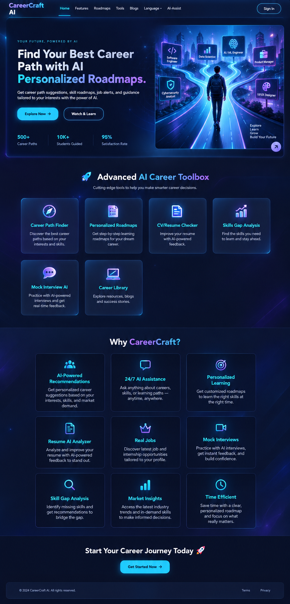

# 🚀 CareerPilotAI
### AI-Powered Career Guidance & Job Readiness Platform

CareerPilotAI is an AI-powered career guidance platform built to help students and job seekers understand their strengths, explore suitable tech paths, improve their skills, and prepare for real-world opportunities. It brings career assessment, roadmap guidance, resume review, interview support, and job-preparation tools into one focused experience.

The platform solves a common problem in career development: users often have skills and ambition, but not a clear path to make them visible to employers. CareerPilotAI helps turn uncertainty into direction by combining structured guidance with AI-powered analysis.

---

## ✨ Key Features

### 🎯 Career Guidance
- AI-powered career recommendations based on skills and interests
- Career path exploration across multiple technology roles
- Assessment-based guidance for skill strengths and growth areas
- Personalized learning and roadmap suggestions
- Role and skill-based roadmap pages for technical learning tracks

### 📄 Resume & Portfolio
- Resume builder and resume review workflow
- ATS-focused resume generation and improvement recommendations
- Portfolio generation and public portfolio routes
- AI-supported resume enhancement suggestions
- Career target selection for role-specific content generation

### 🤖 AI Assistant
- Career guidance chat assistant for user questions and next-step advice
- AI-powered recommendations for career paths and role fit
- Resume and study-plan generation based on user profile and goals
- Interview preparation and answer feedback support
- Salary insight, negotiation, and outreach assistance tools

### 💼 Job & Career Preparation
- Job search and opportunities browsing
- Mock interview flow with feedback support
- Skill quiz and assessment-based learning reinforcement
- Salary insight and negotiation simulator
- Networking outreach generation for professional communication
- Certificate, profile, and progress tracking experience

---

## 📸 Platform Screenshots

| Screenshot | Description |
|---|---|
|  | Main landing page and career guidance overview |
|  | Personalized dashboard and career progress overview |
|  | Career and skill roadmap exploration |

---

## 🛠️ Tech Stack

| Layer | Technology |
|---|---|
| Frontend | React 19, Vite, React Router |
| Backend | Node.js, Express.js |
| Database | MongoDB, Mongoose |
| AI | Google Generative AI |
| Authentication | JWT, bcryptjs |
| API Communication | Axios |
| Security | Helmet, CORS, express-rate-limit |
| Email | Nodemailer |
| Deployment | Vercel-ready frontend; Node/Express backend deployable on Render or similar hosting |

---

## 🏗️ Project Architecture

```text
CareerPilotAI/
├── backend/
│   ├── config/
│   ├── controllers/
│   ├── middleware/
│   ├── models/
│   ├── routes/
│   ├── services/
│   ├── package.json
│   ├── server.js
│   └── .env.example (if configured locally)
├── frontend/
│   ├── public/
│   ├── src/
│   │   ├── assets/
│   │   ├── components/
│   │   ├── context/
│   │   ├── pages/
│   │   ├── services/
│   │   ├── App.jsx
│   │   ├── index.jsx
│   │   └── App.css
│   ├── package.json
│   ├── vite.config.js
│   └── index.html
├── docs/
├── scratch/
├── home.png
├── dashboard_screenshot.png
├── roadmaps_screenshot.png
├── README.md
├── LICENSE
└── .gitignore
```

---

## 🧩 Core Application Flow

The application is split between a frontend React app and a Node/Express backend.

- The frontend delivers the user experience for career discovery, roadmaps, resumes, interviews, jobs, and AI assistance.
- The backend exposes career and auth APIs for recommendations, job data, resume analysis, interview flow, and user management.
- MongoDB stores user and progress-related records, while Gemini powers the AI-generated guidance and recommendations.

---

## 🚀 Getting Started

### Prerequisites
- Node.js 18+
- MongoDB running locally or via MongoDB Atlas
- A Google Gemini API key
- Optional: Gmail app password for email features

### 1) Clone the repository
```bash
git clone <your-repository-url>
cd CareerPilotAI
```

### 2) Backend setup
```bash
cd backend
npm install
```

Create a `.env` file in the `backend` folder:

```env
PORT=5001
MONGO_URI=mongodb://localhost:27017/careercraft
GEMINI_API_KEY=your_gemini_api_key
JWT_SECRET=your_jwt_secret
FRONTEND_URL=http://localhost:5173
EMAIL_USER=your_email@gmail.com
EMAIL_PASS=your_email_app_password
```

Start the API server:

```bash
npm run dev
```

### 3) Frontend setup
```bash
cd ../frontend
npm install
npm run dev -- --host 0.0.0.0
```

Open the app in the browser:

```text
http://localhost:5173/
```

---

## 📍 Key Features by Page

The current project includes the following functional areas:

- Home and career overview experience
- Career assessment and recommendation flow
- Role-based and skill-based roadmaps
- Resume builder and ATS review tools
- AI assistant and chat-driven guidance
- Job search and job matching workflow
- Mock interview support
- Salary insight and negotiation simulator
- Outreach generation and communication support
- Portfolio and profile features
- User authentication, progress tracking, and leaderboard support

---

## 📌 Notes

This project is actively structured around career readiness and AI-assisted guidance for technical learning paths. It is designed for students, career switchers, and users who want a more focused, evidence-based path from exploration to job readiness.

---

## 👥 Contributing

Contributions are welcome. If you want to improve the platform, you can:

1. Fork the project
2. Create a feature branch
3. Commit your changes
4. Open a pull request with a clear description

---

## ✅ Project Status

CareerPilotAI is a functional full-stack career guidance application with a React frontend, Node/Express backend, MongoDB data model, and AI-assisted career tooling for assessment, learning, resume, and interview preparation.

