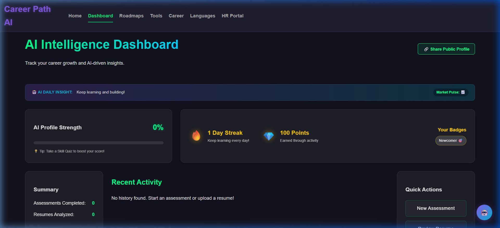
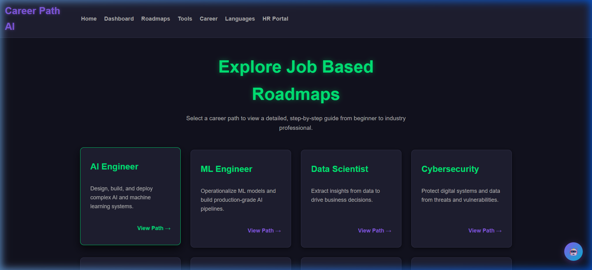

<div align="center">
  
  
  # 🚀 CareerCraft: AI-Powered Career Path Recommendation
  
  **The Ultimate AI Career Compass & B2B Recruitment Ecosystem**
  
  [](https://reactjs.org/)
  [](https://nodejs.org/)
  [](https://vitejs.dev/)
  [](https://mongodb.com/)
  [](https://ai.google.dev/)
</div>

<br />

CareerCraft is an **AI-powered "Super App"** designed to bridge the gap between job seekers and recruiters. It acts as a comprehensive ecosystem that helps students, graduates, and career switchers explore tech roles, prepare for interviews, and build stunning portfolios—all while giving HR professionals a dedicated portal for smart candidate matchmaking.

Built specifically to solve real-world career confusion through dynamic roadmaps and AI-driven gamification.

---

## 📸 Platform Sneak Peek

<div align="center">
  
  <br/>
  
  
</div>

---

## ✨ Key Features (The Super App Ecosystem)

### 📚 For Students & Job Seekers
*   **🧠 AI Career Assessment:** Get personalized career recommendations using Google Gemini AI.
*   **🗺️ Interactive Roadmaps:** Step-by-step paths for Data Science, AI, Full Stack, Cybersecurity, etc., with dynamic progress tracking.
*   **🏆 Gamified Experience:** Earn points, maintain streaks, and collect badges (`Newcomer 🎯`, `Fast Learner ⚡`) by completing learning modules.
*   **📄 AI Resume Builder & ATS Generator:** Create stunning, ATS-friendly PDF resumes in seconds.
*   **💼 1-Click Portfolio:** Instantly generate a live, beautifully designed portfolio website from your profile data.
*   **🛠️ AI Career Toolbox:** 
    *   **GitHub Analyzer:** Instant code quality checks and profile reviews.
    *   **Video Resume Script Generator:** Perfect 60-second intro scripts.
    *   **Salary Insight & Negotiation Simulator:** AI-powered market range checks and interactive HR negotiation practice.
    *   **Networking Suite:** Draft professional LinkedIn outreach messages automatically.
*   **🌍 100% Public Access:** No login required! The entire platform is open for guest users to explore seamlessly.
*   **🔐 Secure Authentication:** JWT-based login, rate limiting, and an Email-based password recovery system.

### 🏢 For HR & Recruiters (B2B Portal)
*   **🔍 Smart Candidate Matchmaking:** Filter and find candidates based on verified skills and completed roadmaps.
*   **📊 Analytics Dashboard:** Track candidate progress, test scores, and overall platform engagement.

---

## 🚀 Tech Stack & Architecture

| Layer | Technologies Used |
| :--- | :--- |
| **Frontend** | React 19, Vite 7, React Router 7, Vanilla CSS (Glassmorphism UI) |
| **Backend** | Node.js, Express.js |
| **Database** | MongoDB (Mongoose ORM) |
| **AI Integration** | Google Gemini AI API (`gemini-2.5-flash`) |
| **Security** | `bcryptjs`, `jsonwebtoken`, `helmet`, `express-rate-limit` |
| **Utilities** | `nodemailer` (Emails), `python-pptx`, `reportlab` |

---

## 🛠️ Quick Start Guide

### Prerequisites
- [Node.js](https://nodejs.org/) (v18 or higher)
- [MongoDB](https://www.mongodb.com/try/download/community) (Local instance or MongoDB Atlas URI)
- A Google Gemini API Key
- A Gmail App Password (for email features)

### 1️⃣ Clone the Repository
```bash
git clone https://github.com/Harishganth-0704/AI-Based-Smart-Career-Guidance-Recruitment-Platform.git
cd AI-Based-Smart-Career-Guidance-Recruitment-Platform
```

### 2️⃣ Backend Setup
```bash
cd backend
npm install
```
Create a `.env` file in the `backend/` directory:
```env
PORT=5001
MONGO_URI=your_mongodb_connection_string
GEMINI_API_KEY=your_gemini_api_key
JWT_SECRET=your_jwt_super_secret_key
FRONTEND_URL=http://localhost:5174
EMAIL_USER=your_gmail@gmail.com
EMAIL_PASS=your_16_char_gmail_app_password
```
Start the backend server:
```bash
npm run dev
# Server will run at http://localhost:5001
```

### 3️⃣ Frontend Setup
Open a new terminal window:
```bash
cd frontend
npm install
npm run dev
```
*Frontend will run at `http://localhost:5174` (or 5173)*

---

## 📂 Project Structure

```text
AI-Based-Smart-Career-Guidance-Recruitment-Platform/
├── backend/                  # Node.js & Express API
│   ├── controllers/          # API Logic (Auth, Roadmap progress)
│   ├── middleware/           # JWT Protection & Rate Limiters
│   ├── models/               # MongoDB Schemas (User)
│   ├── routes/               # API Endpoints
│   └── server.js             # Entry Point
├── frontend/                 # React UI
│   ├── src/
│   │   ├── components/       # Reusable UI (Navbar, Chatbot)
│   │   ├── context/          # Global State (AuthContext)
│   │   ├── pages/            # Dashboards, Roadmaps, AI Tools
│   │   ├── services/         # Axios API Configuration
│   │   └── App.jsx           # Main Router
│   └── vite.config.js
└── docs/                     # Auto-generated PPT & PDF Reports
```

---

## 👨‍💻 Developer Profile

<div align="center">
  
  
  ### Harish Ganth
  **Full Stack Developer | B.E. CSE (Honors)**
  
  [GitHub](https://github.com/Harishganth-0704) | [LinkedIn](https://linkedin.com/in/harishganth07)
</div>

---

## 🤝 Contributing
Contributions, issues, and feature requests are welcome!
1. Fork the Project
2. Create your Feature Branch (`git checkout -b feature/AmazingFeature`)
3. Commit your Changes (`git commit -m 'Add some AmazingFeature'`)
4. Push to the Branch (`git push origin feature/AmazingFeature`)
5. Open a Pull Request

## 📄 License
This project is licensed under the MIT License - see the LICENSE file for details.
